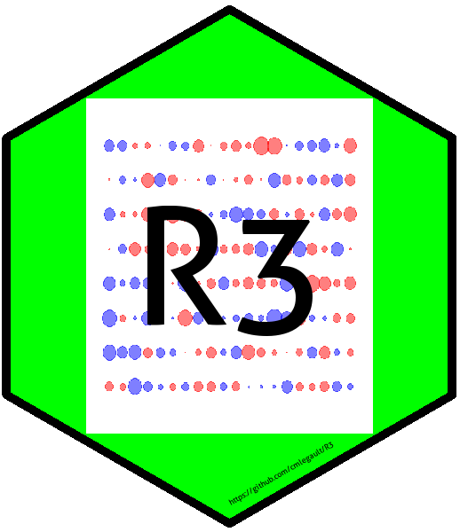

# R3
Recognizing Random Residuals

Think you can identify random vs biased residuals in age composition bubble plots? Try this Shiny app game to see. Now available by pointing your browser [here](https://connect.fisheries.noaa.gov/random-residuals/).  

